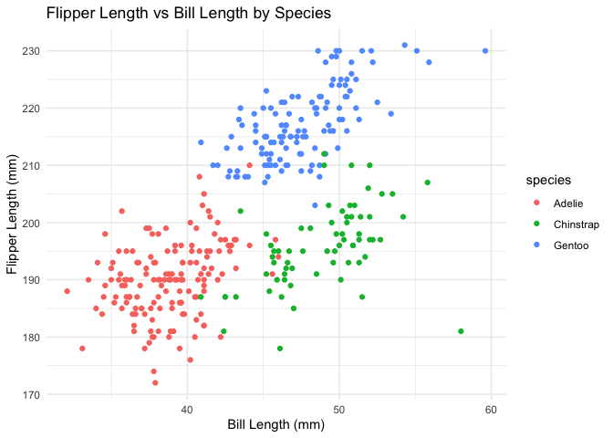

p8105_hw1_rkk2139
================
Riya Kalra

<font size="5"><b>Problem 1</b></font>

\#Load dataset

``` r
data("penguins", package = "palmerpenguins")
```

The **penguins** dataset contains various variables for different
penguin species in the Palmer Archipelago. It includes 344 rows and 8
columns, and important variables include:

- `species`: species of penguins (Adelie, Chinstrap, Gentoo),
- `island`: the island where the penguins were observed,
- `bill_length_mm`: the length of the penguin’s bill in millimeters,
- `bill_depth_mm`: the depth of the penguin’s bill in millimeters,
- `flipper_length_mm`: the length of the penguin’s flipper in
  millimeters, and
- `body_mass_g`: the body mass of the penguin in grams.

The mean flipper length across all penguins is 200.92 mm.

``` r
# Scatterplot of flipper_length_mm vs bill_length_mm, colored by species
ggplot(penguins, aes(x = bill_length_mm, y = flipper_length_mm, color = species)) +
  geom_point() +
  labs(title = "Flipper Length vs Bill Length by Species",
       x = "Bill Length (mm)",
       y = "Flipper Length (mm)") +
  theme_minimal()
```

<!-- -->

``` r
# Export the scatterplot to the project directory
ggsave("penguins_flipper_vs_bill.png", width = 6, height = 4)
```

<font size="5"><b>Problem 2</b></font>

``` r
# Create a data frame
coercion_df <- data.frame(
  numeric_sample = rnorm(10),  # Random sample from a standard Normal distribution
  logical_vector = rnorm(10) > 0,  # Logical vector indicating whether elements are greater than 0
  char_vector = sample(letters, 10),  # Random character vector of length 10
  factor_vector = factor(sample(c("Level1", "Level2", "Level3"), 10, replace = TRUE))  # Factor vector with 3 levels
)

print(coercion_df)
```

    ##    numeric_sample logical_vector char_vector factor_vector
    ## 1      -0.5121153           TRUE           u        Level3
    ## 2      -1.4451695          FALSE           q        Level2
    ## 3      -1.4499717           TRUE           d        Level2
    ## 4       0.1545487           TRUE           e        Level3
    ## 5       1.1335575           TRUE           t        Level3
    ## 6      -1.2086461          FALSE           w        Level2
    ## 7       1.9252647           TRUE           r        Level3
    ## 8      -1.5322521           TRUE           g        Level1
    ## 9      -0.3316847          FALSE           n        Level1
    ## 10      0.1159177          FALSE           p        Level3

``` r
# Try to take the mean of each variable
mean_numeric <- mean(pull(coercion_df, numeric_sample))  # Works, because it's numeric
mean_logical <- mean(pull(coercion_df, logical_vector))  # Works, logical values are treated as 0 (FALSE) or 1 (TRUE)
mean_char <- mean(pull(coercion_df, char_vector))  # Doesn't work, you can't take the mean of characters
```

    ## Warning in mean.default(pull(coercion_df, char_vector)): argument is not
    ## numeric or logical: returning NA

``` r
mean_factor <- mean(pull(coercion_df, factor_vector))  # Doesn't work, factors are not numeric
```

    ## Warning in mean.default(pull(coercion_df, factor_vector)): argument is not
    ## numeric or logical: returning NA

``` r
mean_numeric  # Should work
```

    ## [1] -0.3150551

``` r
mean_logical  # Should work (will be a proportion of TRUEs)
```

    ## [1] 0.6

``` r
mean_char     # Will throw an error
```

    ## [1] NA

``` r
mean_factor   # Will throw an error
```

    ## [1] NA

``` r
# Convert variables to numeric types
numeric_logical <- as.numeric(coercion_df$logical_vector)  # Converts TRUE to 1, FALSE to 0
numeric_char <- as.numeric(coercion_df$char_vector)  # Will result in an error, cannot convert characters to numeric
```

    ## Warning: NAs introduced by coercion

``` r
numeric_factor <- as.numeric(coercion_df$factor_vector)  # Converts factors to their underlying integer codes

print(numeric_logical)
```

    ##  [1] 1 0 1 1 1 0 1 1 0 0

``` r
print(numeric_factor)
```

    ##  [1] 3 2 2 3 3 2 3 1 1 3

``` r
# numeric_char will give an error
```
